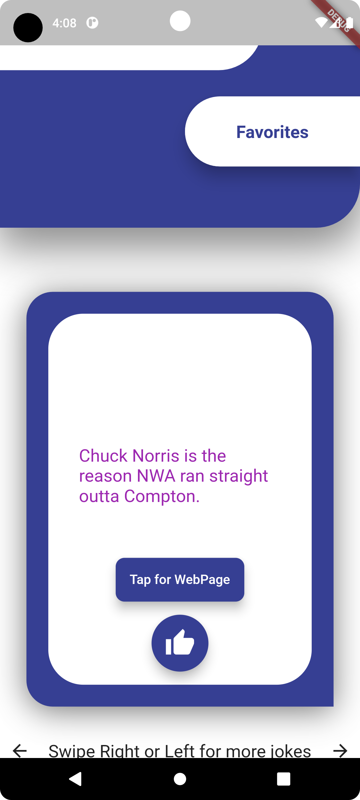

## Chuck Norris 2.0 Application
Chuck Norris is a simple FLutter application developped for Android. The application consist of one HomePage page. The application has 2 basic functionalities, Showing jokes and Switching jokes. In this page, a tinder card is used to show one joke at a time. Inside card there is the category of the joke and the joke itself . In the bottom side of the card there is a button embeded to direct the user to WebPage of the joke.
### User Guide
When the application is opened for the first time, A joke is being presented. Swiping cards to left or right whill change the joke and show a new random joke. Also to see the webpage of the joke click on the button to redirect to WebPage. Although the application will not crash without connecting to internet (the exceptions are being handle using Null Safety feature),  an intrnet conncetion is required to exploit all features of application. Furthermore, There is a like button in the screen which is being used to add a joke to favorites. Also there is a button to navigate to favourites jokes page.
### Technical Guide
- ##### Networking: 
   Http protocol is used to carry out networking part of the application. There is only one endpoint in which Get method is being used to fetch the data. The respones that is being sent is in Json format. A serializer is being used to convert Json data into Dart. The Json Object has 7 properties from which only 4 is being used in our application. So the serializer extract only 4 properties. These four properties are as followed: "categories", "value", "url" and "id". ***category*** property is the list of a list of categories(string) of the joke. Most of the times its is an empty list. In this case  we return **undefined** as the category. ***value*** is a sting that contains the joke itself. ***url*** is property that have the url to the **Web page** of the current joke. ***id*** is the property which is not being used in UI directly, instead, it is being used to check if a new joke have been fetched or not, and while waiting for ***get request*** to get response, the application shows ***CircularProgressIndicator***. 
 ##### Architecture:
 In this application ***Provider*** library have been used for getting data. Using ***ChangeNotifierProvider*** the data flow is been safely granteed. Also data is beeing persisted using ***SharedPreferences***

**Click** [HERE](https://drive.google.com/file/d/1zeZlNtD-0LNcX-kKYBZgdyGS_sywgDYO/view?usp=sharing) **for APK**.

This is the home page of the application:

Pressing button will lunch a the url and redirect to WebPage that contains the Joke(1) shown in figure below:

